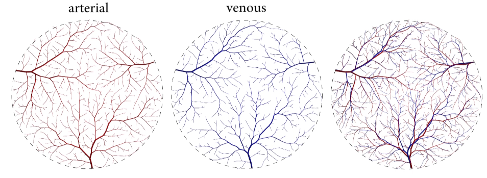
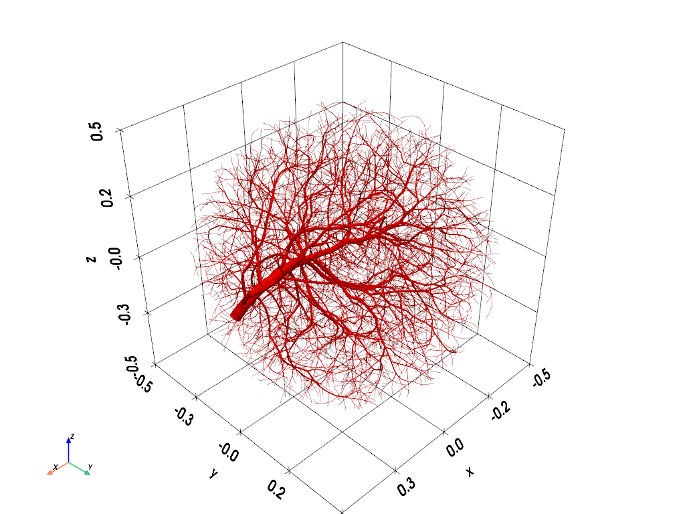
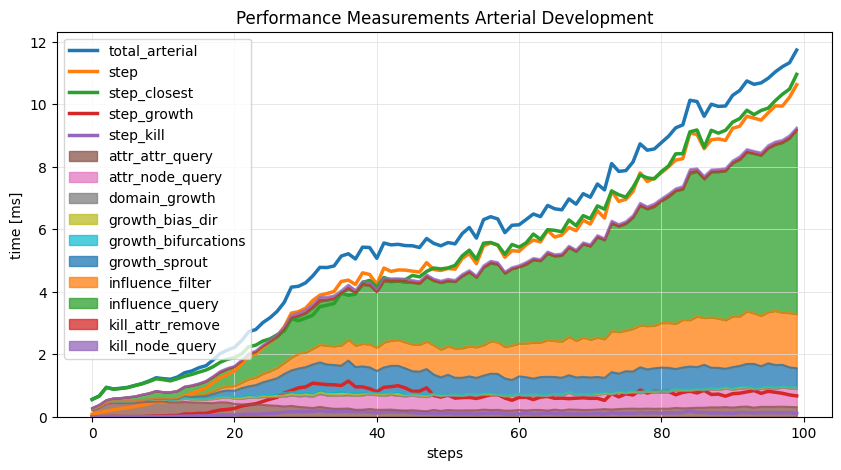

# Blood-Vessel Synthesizer

This repository contains the implementation of the blood-vessel tree generator as outlined in our paper:   
:books: [Rauch N., Harders M., *Interactive Synthesis of 3D Geometries of Blood Vessels*, Eurographics 2021](https://diglib.eg.org/items/9e8cfe4d-b01a-4665-b3ab-f6e1857b40ee)



The synthesizer emulates the abstract behavior of *angiogenesis* - a growth process in which blood vessels develop by elongating and branching from pre-existing vasculature to reach tissue devoid of any vasculature.
The overall mechanism resembles the competiton for space between individual branches and which we modeled by the *space colonization* algorithm.
During development the geometry of branches and bifurcations are constrained to replicate commonly observed vascular patterns.

### Build

The synthesizer is implemented as a C++ library, but python-bindings are also provided (enable by cmake option).

```bash
$ mkdir build && cd build/
$ cmake -DCMAKE_BUILD_TYPE=Release ..
$ cmake --build .
```

The following compile options are available:
| option    | description |
| --------  | -------     |
| VS_PYTHON_BINDINGS   | Build Python Bindings (module)                                 |
| VS_PROFILER          | Build with Profiler Functionality (performance measurements)   |
| VS_COMPILE_NATIVE    | compile for micro-architecture and ISA extensions of the host  |
| VS_COMPILE_FASTMATH  | compile with fastmath optimization                             |

and are enabled when configuring with cmake:
```
cmake -DCMAKE_BUILD_TYPE=Release -DVS_PYTHON_BINDINGS=ON -DVS_PROFILER=ON ..
```

### Python Example

Check-out the notebook **notebook/api_showcase.ipynb** for examples on how to use the python-module.

> ⚠️ library does not statically link the c++ libraries; on windows you need to move the necessary .dll to the lib folder:
> * e.g. mingw (pthread) you need to add libgcc_s_seh-1.dll, libstdc++-6.dll, libwinpthread-1.dll

```python
# set path to compiled vessel module / library
import sys
sys.path.insert(0, '../build/lib/')
import vessel_module as vs

# define domain in which vessels should grow; can be = DomainCircle, DomainSphere, DomainLines, DomainVoxels
sphere = vs.DomainSphere([0.0, 0, 0], 0.5)

# create synthesizer object for domain
synth = vs.Synthesizer(sphere)

# modify settings (these are highly dependent on the dimensions of the domain, use scale to find an initial setup where things work)
synth.settings.steps = 100
synth.settings.samples = 1000
synth.settings.scale(1.5)

# set root note of tree (or use set_forest(...)) to grow from intial trees
synth.create_root(vs.System.ARTERIAL, [0.5, 0.0, 0.0])
synth.run()

```


```python
# check if library was compiled with performance monitor
if vs.PerfMonitor.Enabled:
    import pandas as pd
    import matplotlib.pyplot as plt

    # retrieve time measurements as dictonary
    times = synth.get_arterial_perftimes()

    # create pandas dataframe
    df = pd.DataFrame.from_dict(times)
    df = df.astype("timedelta64[ns]").astype("int64")
    df = df / 1e+6;

    # plot
    columns = ["total_arterial", "step", "step_closest", "step_growth", "step_kill"]
    fig, ax = plt.subplots(figsize=(10,5))
    df[columns].plot(ax = ax, kind="line", lw=2.5)
    df[df.columns.difference(columns)].plot(ax = ax, kind="area", stacked=True, alpha=0.75)

    ax.set_title("Performance Measurements Arterial Development")
    ax.set_xlabel("steps")
    ax.set_ylabel("time [ms]")
    ax.grid(which='major', color='#DDDDDD', linewidth=0.5)
```
